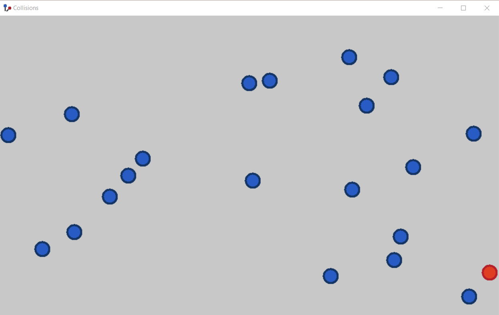
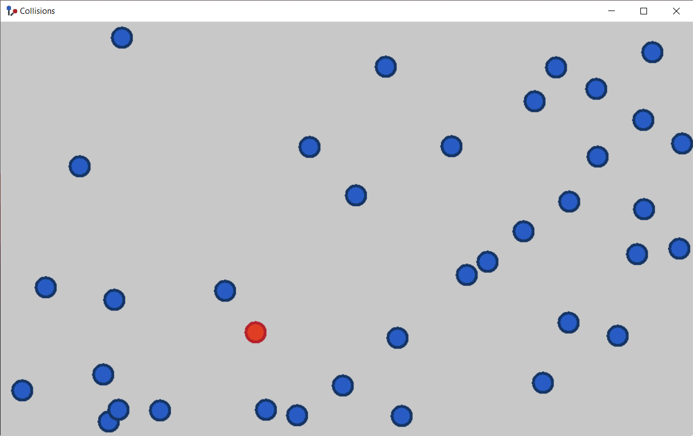

# PP-2-FIZ-project
Group project aiming to simulate perfect elastic collisions.

## Controls
`LMB` to add new object. `RMB` to delete existing object. Drag object by clicking `LMB` on it to change its velocity.

